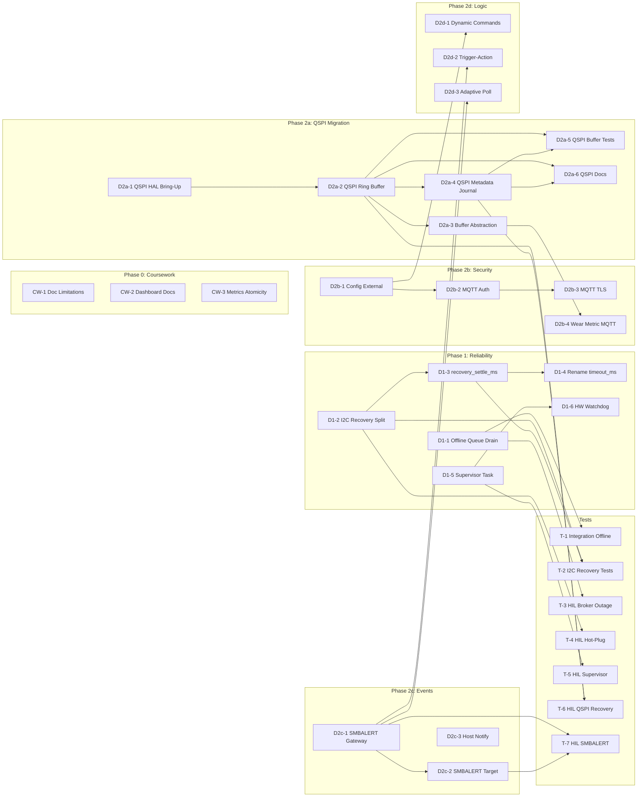

# PMBus Edge Gateway — Story Backlog

> **Prioritization Strategy**: This backlog is divided into four priority tiers to help balance implementation with thesis writing.
> - **P0 (Critical)**: Truth in docs and basic data reliability (no drops on outage). **Must stay.**
- **P1 (High/Core)**: QSPI, SMBALERT, and **Edge Intelligence**. These are your main technical contributions. **Recommended.**
- **P2 (Medium)**: Supervisor/Watchdog & Adaptive Polling. Good for "Robustness" claims but optional.
- **P3 (Low/Hardening)**: MQTT Security & Host Notify. Usually out of scope or future work.

> **Parallel Execution**: Stories without dependencies or from different branches can run in parallel. See the graph below.

---

## Phase 0: Coursework Closeout

> **Goal**: Freeze coursework baseline with truthful docs and one low-risk patch.  
> **Constraint**: No architecture changes to buffer/I2C path. No MQTT schema/topic/profile changes.  
> **Em_EEPROM**: Leave as-is. Do not break the working demo.

---

### CW-1 · Document Known Limitations in README and Report

| Field | Value |
|---|---|
| **Priority** | **P0 (Critical)** |
| **Lean Thesis** | **YES** |
| **Scope** | Add a "Known Limitations" section to [README.md](file:///e:/mtb_workspace/thesis_proj/README.md). Mirror in thesis report draft if applicable. |
| **Details** | Document 4 explicit limitations: (1) Live telemetry may be lost during prolonged broker outage due to FreeRTOS queue overflow; (2) Current I2C bus recovery is lab-grade, not a robust hot-plug solution; (3) MQTT transport is plaintext without authentication — lab-only; (4) Flash buffer uses internal Em_EEPROM (63 records max, no wear-leveling on metadata row). |
| **Affected files** | [README.md](file:///e:/mtb_workspace/thesis_proj/README.md) |
| **Acceptance criteria** | Section exists, each limitation is a clearly worded bullet with context on why it's acceptable for thesis scope. |
| **Dependencies** | None |
| **Size** | S |

---

### CW-2 · Document Dashboard Limitations

| Field | Value |
|---|---|
| **Scope** | Add inline comments or a "Limitations" note in [scripts/dashboard/index.html](file:///e:/mtb_workspace/thesis_proj/scripts/dashboard/index.html) (or a companion [README.md](file:///e:/mtb_workspace/thesis_proj/README.md) in `scripts/dashboard/`) documenting: WebSocket-only (no retained MQTT state on connect), no offline data replay, chart memory grows unbounded in long sessions. |
| **Affected files** | `scripts/dashboard/index.html` or `scripts/dashboard/README.md` |
| **Acceptance criteria** | A reader opening the dashboard project for the first time understands its scope limitations. |
| **Dependencies** | None |
| **Size** | S |

---

### CW-3 · Unify `metrics_inc_*()` Atomicity Policy

| Field | Value |
|---|---|
| **Scope** | Apply a consistent atomicity policy to all `metrics_inc_*()` functions in `metrics.c`. Currently `metrics_inc_queue_drops()` uses `taskENTER/EXIT_CRITICAL` while all others do not. |
| **Decision to make** | Either: (A) Remove the critical section from `queue_drops` (document that single-writer pattern is relied upon), or (B) Add critical sections to all other `metrics_inc_*()` functions. Recommend option (A) + add a code comment block explaining the safety rationale. |
| **Affected files** | `rtos_test/source/metrics.c`, `rtos_test/source/metrics.h` (comment only) |
| **Acceptance criteria** | All `metrics_inc_*()` use the same pattern. A comment at the top of the counter section explains why. `make test` still passes. |
| **Dependencies** | None |
| **Size** | S |

---

## Phase 1: Diploma Sprint 1 — Reliability First

> **Goal**: Eliminate `queue_drops` as normal behavior during broker outage; harden I2C recovery; add supervisor watchdog.  
> **Constraint**: No MQTT topic/schema changes. No buffer/storage architecture changes yet.

---

### D1-1 · Refactor `mqtt_gw_task` Offline Queue Draining

| Field | Value |
|---|---|
| **Priority** | **P0 (Critical)** |
| **Lean Thesis** | **YES** |
| **Scope** | Restructure the main loop in `mqtt_gw_task.c` so that FreeRTOS queues (telemetry, status, events) are **always drained**, even when MQTT is offline. When offline, dequeued records should be JSON-encoded and stored in `buffer_mgr` instead of being published. |
| **Current behavior** | During `backoff_wait()`, the task blocks in `vTaskDelay` and does not drain queues. If the poll task continues enqueuing, queues fill up → `queue_drops`. |
| **Target behavior** | The reconnect/backoff loop interleaves with queue draining. Queue depth should stay near zero; buffer depth should grow instead. `queue_drops` in a normal outage → 0. |
| **Affected files** | `rtos_test/source/mqtt_gw_task.c` |
| **Acceptance criteria** | (1) During a 60s simulated broker outage on `default` profile, `queue_drops` counter stays at 0; (2) `buffer_depth_ram` grows proportionally to outage duration; (3) After reconnect, buffered records are flushed; (4) No changes to MQTT topics or JSON schemas. |
| **Dependencies** | None |
| **Size** | M |

---

### D1-2 · Separate Timeout vs Bus Error Recovery in `pmbus_master.c`

| Field | Value |
|---|---|
| **Scope** | Currently both `PMBUS_ERR_TIMEOUT` and `PMBUS_ERR_BUS` trigger the same 9×SCL bus recovery. Separate them: (1) On **timeout**: abort transfer + SCB reinit/reset path (disable → re-init → re-enable SCB3). (2) On **bus error**: 9×SCL only as fallback after SCB reset fails. |
| **Affected files** | `rtos_test/source/pmbus_master.c`, `rtos_test/source/pmbus_master.h` (add `pmbus_scb_reset()` if needed) |
| **Acceptance criteria** | (1) `PMBUS_ERR_TIMEOUT` retry path calls SCB reset, not `pmbus_bus_recovery()`; (2) `PMBUS_ERR_BUS` retry path tries SCB reset first, then `pmbus_bus_recovery()` as fallback; (3) Event posted for each recovery path taken; (4) `make test` passes; (5) HIL: hot-unplug target → gateway recovers without manual reset. |
| **Dependencies** | None |
| **Size** | M |

---

### D1-3 · Add `recovery_settle_ms` to I2C Config

| Field | Value |
|---|---|
| **Scope** | Add a `recovery_settle_ms` field to `config_t.i2c` in `gateway_config.h`. After any I2C recovery (SCB reset or bus recovery), delay this many milliseconds before the next transaction. Update all profile headers. |
| **Affected files** | `rtos_test/source/gateway_config.h`, `rtos_test/source/gateway_config.c`, `rtos_test/source/pmbus_master.c`, all `profile_*.h` files |
| **Acceptance criteria** | New field appears in boot banner. Default value = 5ms. Used after every recovery attempt in `pmbus_master.c`. |
| **Dependencies** | D1-2 |
| **Size** | S |

---

### D1-4 · Rename `timeout_ms` → `transaction_timeout_ms`

| Field | Value |
|---|---|
| **Scope** | Rename `g_config.i2c.timeout_ms` → `g_config.i2c.transaction_timeout_ms` for clarity. Update all references. |
| **Affected files** | `gateway_config.h`, `gateway_config.c`, `pmbus_master.c`, all `profile_*.h`, boot banner, docs |
| **Acceptance criteria** | No functional change. All references updated. `make build` succeeds. Boot banner shows new name. |
| **Dependencies** | D1-3 (do after to avoid merge conflict) |
| **Size** | S |

---

### D1-5 · Implement Supervisor / Watchdog Task

| Field | Value |
|---|---|
| **Scope** | Add a new `supervisor_task` (or extend `blinky_task`) that monitors heartbeats from `pmbus_poll_task` and `mqtt_gw_task`. Each monitored task must call a `supervisor_heartbeat(TASK_ID)` function periodically. If a heartbeat is missed for a configurable threshold, the supervisor posts an event and triggers a recovery action (initially: system reset via `NVIC_SystemReset()`). |
| **New files** | `rtos_test/source/supervisor.c`, `rtos_test/source/supervisor.h` |
| **Affected files** | `rtos_test/source/main.c` (create task), `pmbus_poll_task.c` (add heartbeat call), `mqtt_gw_task.c` (add heartbeat call) |
| **Config** | Add `supervisor_timeout_ms` to `config_t` or use compile-time constant. |
| **Acceptance criteria** | (1) LED blink is no longer the only liveness indicator; (2) If `mqtt_gw_task` is artificially blocked for > threshold, supervisor triggers reset; (3) Event `EVT_SUPERVISOR_TIMEOUT` posted before reset; (4) Boot banner shows supervisor config. |
| **Dependencies** | None |
| **Size** | M |

---

### D1-6 · Hardware Watchdog (WDT) Integration

| Field | Value |
|---|---|
| **Scope** | Enable the PSoC 6 hardware WDT with a timeout slightly longer than the supervisor task threshold. The supervisor task kicks the WDT on each cycle. If the supervisor itself hangs, the hardware WDT forces a hard reset. |
| **Affected files** | `rtos_test/source/supervisor.c`, `rtos_test/source/main.c` (WDT init) |
| **Acceptance criteria** | (1) WDT is initialized in `main()` before scheduler start; (2) Only supervisor kicks WDT; (3) If supervisor is killed, board resets within WDT timeout. |
| **Dependencies** | D1-5 |
| **Size** | S |

---

## Phase 2a: Diploma Sprint 2a — QSPI Flash Migration

> **Goal**: Move persistent buffer from internal Em_EEPROM (32KB, 63 records) to external QSPI NOR flash (64 MB S25FL512S), expanding capacity to thousands of records with proper wear management.  
> **Rationale**: This is the single most impactful diploma extension — transforms a lab demo into a credible field-grade data logger.  
> **Constraint**: No MQTT topic/schema changes. Em_EEPROM code stays in repo (compile-time switch to choose backend). LittleFS is deferred as future work.

### Hardware Context

| Parameter | Em_EEPROM (Current) | QSPI NOR (Target) |
|---|---|---|
| **Chip** | PSoC 6 internal flash | S25FL512S (on-board) |
| **Total size** | 32 KB | 64 MB |
| **Erase unit** | 512 B row | 4 KB sector (64 KB block) |
| **Write unit** | 512 B row | 1–256 B page |
| **Write latency** | ~16 ms (blocks CPU) | ~0.5 ms page program (async via SMIF) |
| **Endurance** | 100K cycles/row | 100K cycles/sector |
| **API** | `Cy_Flash_WriteRow()` | `cy_serial_flash_qspi` (ModusToolbox) |
| **Concurrency** | Blocks CM4 during write | SMIF is DMA-capable; Wi-Fi unaffected |

---

### D2a-1 · QSPI HAL Bring-Up & Verification

| Field | Value |
|---|---|
| **Scope** | Initialize the SMIF (Serial Memory Interface) block using the BSP's QSPI Configurator output and `cy_serial_flash_qspi` library. Add a `qspi_flash_init()` function that: (1) calls `cy_serial_flash_qspi_init()` with BSP-provided config; (2) reads JEDEC ID to verify S25FL512S presence; (3) prints capacity and sector size to UART; (4) performs a write/read/erase self-test on a dedicated test sector. |
| **New files** | `rtos_test/source/qspi_flash.c`, `rtos_test/source/qspi_flash.h` |
| **Affected files** | `rtos_test/Makefile` (add `serial-flash` library dependency), `rtos_test/source/main.c` (call init before scheduler start) |
| **Library to add** | `serial-flash` via `make getlibs` (Infineon's `cy_serial_flash_qspi` middleware) |
| **Acceptance criteria** | (1) Boot banner shows `[QSPI] S25FL512S detected, 64 MB, sector=4096`; (2) Self-test passes (write pattern → read back → verify → erase → verify 0xFF); (3) PMBus polling + Wi-Fi + MQTT work normally alongside QSPI init; (4) No XIP (execute-in-place) — QSPI used only for data storage. |
| **Dependencies** | None |
| **Size** | M |

---

### D2a-2 · QSPI Raw Ring Buffer Implementation

| Field | Value |
|---|---|
| **Scope** | Implement a ring buffer on QSPI flash that stores topic+payload records in a dedicated region (e.g., 1 MB at offset 0x000000–0x0FFFFF). The ring buffer must handle 4 KB sector erase granularity. |
| **Design** | Pack multiple records into 4 KB sectors. Each record has: `[magic(4B) \| payload_len(2B) \| topic_len(1B) \| reserved(1B) \| topic(var) \| payload(var) \| crc32(4B)]`. Sector header: `[sector_magic(4B) \| sector_seq(4B)]`. Records are appended sequentially; when a sector fills, advance to the next. Erase-before-write only when the write pointer wraps to a new sector. |
| **New files** | `rtos_test/source/qspi_buffer.c`, `rtos_test/source/qspi_buffer.h` |
| **API** | Same contract as `flash_buffer.h`: `qspi_buffer_init()`, `qspi_buffer_put()`, `qspi_buffer_peek()`, `qspi_buffer_consume()`, `qspi_buffer_depth()`, `qspi_buffer_total_writes()`, `qspi_buffer_erase_all()`. |
| **Capacity** | 1 MB region ÷ ~600 B/record ≈ **~1700 records** (vs. 63 on Em_EEPROM). Configurable region size. |
| **Acceptance criteria** | (1) Records survive power cycle; (2) `qspi_buffer_depth()` reports correct count after reboot; (3) FIFO ordering preserved; (4) No blocking of PMBus poll task (QSPI writes run on `mqtt_gw_task`); (5) Erase/write does not stall Wi-Fi. |
| **Dependencies** | D2a-1 |
| **Size** | L |

---

### D2a-3 · Buffer Manager Abstraction Layer

| Field | Value |
|---|---|
| **Scope** | Refactor `buffer_mgr.c` to use a **backend abstraction** for the persistent tier. Introduce a compile-time switch (`BUFFER_BACKEND_EMULATED_EEPROM` / `BUFFER_BACKEND_QSPI`) that selects between the existing `flash_buffer.*` and the new `qspi_buffer.*`. The RAM tier is unchanged. |
| **Design** | Define a `persistent_buffer_ops_t` struct with function pointers: `init`, `put`, `peek`, `consume`, `depth`, `total_writes`, `erase_all`. At init, `buffer_mgr` selects the appropriate ops table. Alternatively, use `#ifdef` if function pointers add too much overhead. |
| **Affected files** | `rtos_test/source/buffer_mgr.c`, `rtos_test/source/buffer_mgr.h`, `rtos_test/source/gateway_config.h` (add backend enum) |
| **Acceptance criteria** | (1) `BUFFER_BACKEND_EMULATED_EEPROM` builds and runs identically to current behavior; (2) `BUFFER_BACKEND_QSPI` uses `qspi_buffer_*` functions; (3) Boot banner shows active backend; (4) All existing tests still pass. |
| **Dependencies** | D2a-2 |
| **Size** | M |

---

### D2a-4 · QSPI Metadata Journal (Wear-Leveling)

| Field | Value |
|---|---|
| **Scope** | The QSPI ring buffer needs head/tail metadata. Instead of writing metadata to a single location (same wear problem as Em_EEPROM), implement a **metadata journal** that rotates across a dedicated 4 KB sector. Each metadata write appends a ~32B entry with an incrementing sequence number. When the sector fills, erase and restart. On boot, scan for the highest valid sequence. |
| **Design** | Reserve sector 0 (0x000000–0x000FFF) for metadata journal. Each entry: `[magic(4B) \| seq(4B) \| head_sector(2B) \| head_offset(2B) \| tail_sector(2B) \| tail_offset(2B) \| count(4B) \| total_writes(4B) \| crc32(4B)]` = 28 bytes. 4096 ÷ 28 ≈ **146 metadata writes before erase** → wear reduced 146×. |
| **Affected files** | `rtos_test/source/qspi_buffer.c` (internal metadata module) |
| **Acceptance criteria** | (1) Metadata rotates within the journal sector; (2) After simulated corruption of one entry, boot finds the previous valid entry; (3) After journal sector full, erase + restart works; (4) Wear metric tracks total metadata sector erases. |
| **Dependencies** | D2a-2 |
| **Size** | M |

---

### D2a-5 · QSPI Buffer Host-Side Tests

| Field | Value |
|---|---|
| **Scope** | Create host-side unit tests for `qspi_buffer.c` using a RAM-backed QSPI flash emulation (mock `cy_serial_flash_qspi_read/write/erase`). Must emulate 4 KB sector erase granularity and page-write constraints. |
| **New files** | `rtos_test/tests/test_qspi_buffer.c`, `rtos_test/tests/stubs/qspi_mock.c` |
| **Affected files** | `rtos_test/Makefile` (add new test target) |
| **Test cases** | (1) Normal put/peek/consume cycle; (2) Sector boundary crossing; (3) Ring buffer wrap-around; (4) Power-cycle recovery (reinit from metadata journal); (5) Corrupted metadata entry → fallback to previous; (6) Full journal sector → erase + restart; (7) Capacity limits. |
| **Acceptance criteria** | `make test` runs the new test binary. All cases pass. |
| **Dependencies** | D2a-2, D2a-4 |
| **Size** | M |

---

### D2a-6 · Update Documentation for QSPI Migration

| Field | Value |
|---|---|
| **Scope** | Update `docs/persistent_buffer.md` to document the new QSPI backend: hardware context (S25FL512S specs), ring buffer layout, metadata journal design, endurance analysis, and compile-time backend selection. Add a "Migration from Em_EEPROM" section. Update `README.md` build instructions. |
| **Affected files** | `docs/persistent_buffer.md`, `README.md` |
| **Acceptance criteria** | Document reflects QSPI design. Includes: endurance calculation, capacity comparison table, and build instructions for selecting backend. |
| **Dependencies** | D2a-2, D2a-4 |
| **Size** | S |

---

## Phase 2b: Diploma Sprint 2b — Security & Hardening

> **Goal**: MQTT auth, config externalization, and minor remaining hardening.  
> **Constraint**: No MQTT topic/schema changes.  
> **Note**: `buffer_task` merge and CRC lookup-table are explicitly deferred until after reliability/storage issues are closed.

---

### D2b-1 · Externalize Broker Host & Credentials from Profile Headers

| Field | Value |
|---|---|
| **Scope** | Move `mqtt.host`, `mqtt.port`, `mqtt.client_id` out of the compile-time profile headers into a separate git-ignored config file (similar to `wifi_config.h`). Create a `mqtt_deploy_config.h` template. |
| **Affected files** | `rtos_test/source/gateway_config.c`, all `profile_*.h`, new `rtos_test/configs/mqtt_deploy_config.h.template` |
| **Acceptance criteria** | (1) Default build works with template values; (2) Lab build uses local overrides from git-ignored file; (3) Changing broker host does not require modifying a profile header; (4) `README.md` updated with config instructions. |
| **Dependencies** | None |
| **Size** | S |

---

### D2b-2 · MQTT Username/Password Authentication

| Field | Value |
|---|---|
| **Scope** | Add MQTT username/password fields to the deploy config. Pass them to `cy_mqtt_connect()` via `connection_info.username` / `.password`. Update the mosquitto config to require authentication (password file). |
| **Affected files** | `rtos_test/source/mqtt_gw_task.c`, `mqtt_client_config.c/.h`, `mqtt_deploy_config.h.template`, `scripts/mqtt_broker/mosquitto.conf` |
| **Acceptance criteria** | (1) With auth enabled, gateway connects with valid credentials; (2) With invalid credentials, gateway logs auth failure and retries with backoff; (3) Mosquitto `password_file` example provided; (4) Dashboard documented with optional auth. |
| **Dependencies** | D2b-1 |
| **Size** | M |

---

### D2b-3 · MQTT TLS Support (Hardening)

| Field | Value |
|---|---|
| **Scope** | Enable TLS in the `cy_mqtt` middleware. Add cert/key paths or embedded certs to the deploy config. Support both `mqtts://` (port 8883) and plain `mqtt://` (port 1883) based on config flag. |
| **Affected files** | `rtos_test/source/mqtt_gw_task.c`, `mqtt_client_config.c/.h`, `mqtt_deploy_config.h.template`, `scripts/mqtt_broker/mosquitto.conf` |
| **Acceptance criteria** | (1) With TLS ON, gateway connects to broker on port 8883 with server cert validation; (2) With TLS OFF, behavior is unchanged; (3) Boot banner shows TLS status; (4) `scripts/mqtt_broker/` includes a self-signed cert generation guide. |
| **Dependencies** | D2b-2 |
| **Size** | L |

---

### D2b-4 · Expose `total_writes` Wear Metric via MQTT

| Field | Value |
|---|---|
| **Scope** | Add `storage_total_writes` and `storage_backend` fields to the metrics JSON output. This exposes the wear counter (from either Em_EEPROM or QSPI backend) and the active backend name in the metrics topic. |
| **Affected files** | `rtos_test/source/metrics.c`, `rtos_test/source/metrics.h` |
| **Acceptance criteria** | (1) Metrics JSON includes `"storage":{"backend":"qspi","total_writes":1234}`; (2) Dashboard can display the value (no dashboard code change required — it's just a new JSON field). |
| **Dependencies** | D2a-3 |
| **Size** | S |

---

## Phase 2c: Diploma Sprint 2c — Event-Driven Monitoring

> **Goal**: Replace periodic polling with event-driven alerts for faults, reducing bus traffic and improving response time.  
> **Rationale**: Perfect for thesis comparison: "Polling vs. Interrupts in Industrial Bus Systems."

---

### D2c-1 · SMBALERT/ARA Gateway Implementation

| Field | Value |
|---|---|
| **Priority** | **P1 (High)** |
| **Lean Thesis** | **YES** |
| **Scope** | Configure a GPIO (CYBSP_I2C_INT) as a falling-edge interrupt. When fired, the `pmbus_poll_task` sends a read transaction to the **ARA Address (0x0C)**. The responding slave address is then flagged for an immediate status read. |
| **Affected files** | `rtos_test/source/pmbus_master.c/.h`, `rtos_test/source/pmbus_poll_task.c`, `gateway_config.h` |
| **Acceptance criteria** | (1) Gateway detects slave alert without waiting for next poll cycle; (2) ARA protocol implemented correctly (read 0x0C); (3) Multiple slaves handled per cycle (repeat ARA until high); (4) Metrics track `alert_count`. |
| **Dependencies** | None |
| **Size** | M |

---

### D2c-2 · SMBALERT Target Simulator Implementation

| Field | Value |
|---|---|
| **Priority** | **P1 (High)** |
| **Lean Thesis** | **YES** |
| **Scope** | Implement an alert trigger in the target simulator. Add a command (e.g., via debug UART) that simulates a fault, pulling the SMBALERT# pin low. The pin must be released once the master reads the slave address via ARA. |
| **Affected files** | `target_proj/main.c` |
| **Acceptance criteria** | Simulator correctly asserts/de-asserts the alert line according to SMBus spec. |
| **Dependencies** | D2c-1 |
| **Size** | M |

---

### D2c-3 · Host Notify Protocol Listener (Gateway)

| Field | Value |
|---|---|
| **Priority** | **P3 (Low)** |
| **Lean Thesis** | **NO** |
| **Scope** | Configure the SCB3 in **Master-Slave** mode. Assign slave address **0x08** (SMBus Host). Handle slave-write interrupts to receive incoming notifications from peripheral devices acting as temporary masters. |
| **Affected files** | `rtos_test/source/pmbus_master.c`, `gateway_config.h` |
| **Acceptance criteria** | Gateway receives and logs a "Host Notify" message (3 bytes: address + status word) from a simulated master. |
| **Dependencies** | None |
| **Size** | L |

---

| **Dependencies** | None |
| **Size** | L |

---

## Phase 2d: Diploma Sprint 2d — Edge Intelligence & Dynamic Config

> **Goal**: Move from a "passive bridge" to an "active edge controller" that can react to events and be reconfigured without re-flashing.

---

### D2d-1 · Dynamic Command Polling List (MQTT)

| Field | Value |
|---|---|
| **Priority** | **P1 (High)** |
| **Lean Thesis** | **YES** |
| **Scope** | Expand `device_cfg_t` to include a bitmask of standard PMBus commands to poll. Implement an MQTT `/config` topic handler that updates this mask at runtime. |
| **Affected files** | `rtos_test/source/gateway_config.h`, `rtos_test/source/pmbus_poll_task.c`, `rtos_test/source/mqtt_gw_task.c` |
| **Acceptance criteria** | (1) Gateway starts with default command set; (2) Sending a specific MQTT message enables/disables polling of specific commands (e.g., stop polling `READ_POUT` to save bandwidth); (3) Changes are applied within 1 poll cycle. |
| **Dependencies** | D2b-1 |
| **Size** | M |

---

### D2d-2 · Local Event-Action Engine (Trigger Logic)

| Field | Value |
|---|---|
| **Priority** | **P1 (High)** |
| **Lean Thesis** | **YES** |
| **Scope** | Implement a simple "If-Then" engine in `pmbus_poll_task.c`. Example rule: "If `STATUS_WORD` bit 5 (VOUT_OV) is set, immediately send `OPERATION 0x00` (Quick Off) to the device." Rules should be configurable. |
| **Affected files** | `rtos_test/source/pmbus_poll_task.c` |
| **Acceptance criteria** | (1) Gateway reacts to a simulated fault on the target in < 5ms; (2) Shutdown command is sent autonomously without cloud intervention; (3) Event is logged as `EVT_LOCAL_REACTION_TRIGGERED`. |
| **Dependencies** | D2c-1 |
| **Size** | M |

---

### D2d-3 · Adaptive Polling / Flight Recorder (Alert Driven)

| Field | Value |
|---|---|
| **Priority** | **P2 (Medium)** |
| **Lean Thesis** | **NO** |
| **Scope** | When an SMBALERT is received, (1) Temporarily set the `poll_period_ms` for that device to the minimum (10ms); (2) Divert these high-speed samples to a **Local Flight Recorder** in QSPI flash instead of the live MQTT queue; (3) After 2–5 seconds, return to normal period and publish a summary "Fault Snapshot" via MQTT. |
| **Affected files** | `rtos_test/source/pmbus_poll_task.c`, `rtos_test/source/qspi_buffer.c` |
| **Acceptance criteria** | (1) High-resolution transient data (100 samples/sec) is captured locally without crashing the Wi-Fi/MQTT stack; (2) Live telemetry stream remains stable during the capture; (3) Fault metadata includes the flash address of the high-res record. |
| **Dependencies** | D2c-1, D2a-2 |
| **Size** | M |

---

## Phase T: Test Plan (Cross-Cutting)

> Stories in this phase can be started as soon as the corresponding implementation story is done.

---

### T-1 · Integration Test: Poll → Queue → Buffer Path (Simulated Offline)

| Field | Value |
|---|---|
| **Scope** | Host-side integration test that exercises the full `pmbus_poll_task` → IPC queue → `mqtt_gw_task` → `buffer_mgr` path with a mock MQTT layer that can simulate online/offline transitions. |
| **New files** | `rtos_test/tests/test_integration_offline.c`, `rtos_test/tests/stubs/mqtt_mock.c` |
| **Affected files** | `rtos_test/Makefile` |
| **Acceptance criteria** | Test simulates: (1) Normal flow: records published; (2) Broker goes offline: records buffered; (3) Broker comes back: buffer flushed; (4) `queue_drops == 0` throughout. |
| **Dependencies** | D1-1 |
| **Size** | L |

---

### T-2 · I2C Recovery State Transition Tests

| Field | Value |
|---|---|
| **Scope** | Host-side unit tests for `pmbus_master.c` covering the new separated recovery paths: timeout → SCB reset, bus error → SCB reset → 9×SCL fallback. Mock the PDL I2C functions. |
| **New files** | `rtos_test/tests/test_i2c_recovery.c`, `rtos_test/tests/stubs/i2c_mock.c` |
| **Acceptance criteria** | Tests verify: (1) Timeout triggers SCB reset, not bus recovery; (2) Bus error tries SCB reset first; (3) If SCB reset fails, falls back to 9×SCL; (4) `recovery_settle_ms` delay is applied. |
| **Dependencies** | D1-2, D1-3 |
| **Size** | M |

---

### T-3 · HIL: Broker Outage on Default Profile

| Field | Value |
|---|---|
| **Scope** | Hardware-in-the-loop test procedure: run gateway on `default` profile, stop the mosquitto broker for 60s, restart. Document the procedure as a reproducible experiment script. |
| **New files** | `docs/experiments/hil_broker_outage.md` or `scripts/tests/hil_broker_outage.sh` |
| **Acceptance criteria** | (1) `queue_drops == 0` during outage; (2) `buffer_depth_ram` grows during outage; (3) After reconnect, buffered records flush; (4) No manual gateway reset needed. |
| **Dependencies** | D1-1 |
| **Size** | S |

---

### T-4 · HIL: Target Hot-Plug

| Field | Value |
|---|---|
| **Scope** | Hardware-in-the-loop test: with gateway running, power-cycle the target board. Verify gateway detects offline → online transition, continues polling, no hang/reset. |
| **New files** | `docs/experiments/hil_target_hotplug.md` |
| **Acceptance criteria** | (1) `PMBUS_DEVICE_OFFLINE` event posted within `OFFLINE_FAIL_THRESHOLD × poll_period`; (2) `PMBUS_DEVICE_ONLINE` event posted after target returns; (3) No SCB lockup; (4) Metrics show recovery. |
| **Dependencies** | D1-2 |
| **Size** | S |

---

### T-5 · HIL: Watchdog / Supervisor Verification

| Field | Value |
|---|---|
| **Scope** | Test procedure to verify supervisor detects task starvation. Method: add a temporary debug command (e.g., via UART) that causes `mqtt_gw_task` to enter an infinite delay. Verify supervisor fires within threshold. |
| **New files** | `docs/experiments/hil_supervisor_test.md` |
| **Acceptance criteria** | (1) Supervisor event posted; (2) System resets; (3) Post-reset boot banner visible on UART. |
| **Dependencies** | D1-5 |
| **Size** | S |

---

### T-6 · HIL: QSPI Buffer Power-Cycle Recovery

| Field | Value |
|---|---|
| **Scope** | Hardware-in-the-loop test: run gateway with QSPI backend, buffer several hundred records during broker outage, hard power-cycle the gateway, verify records survive and flush after reboot + reconnect. |
| **New files** | `docs/experiments/hil_qspi_recovery.md` |
| **Acceptance criteria** | (1) `qspi_buffer_depth()` > 0 after reboot; (2) All recoverable records flush successfully; (3) No data corruption detected (CRC checks pass). |
| **Dependencies** | D2a-2, D2a-4 |
| **Size** | S |

---

### T-7 · HIL: SMBALERT/ARA Verification

| Field | Value |
|---|---|
| **Priority** | **P1 (High)** |
| **Lean Thesis** | **YES** |
| **Scope** | Verification procedure: Trigger a fault on the target board; verify the gateway initiates an ARA read within < 10ms (regardless of poll period). |
| **New files** | `docs/experiments/hil_smbalert_verify.md` |
| **Acceptance criteria** | Gateway event log shows `EVT_SMBALERT_RECEIVED` followed by `EVT_DEVICE_FAULT_DETECTED`. |
| **Dependencies** | D2c-1, D2c-2 |
| **Size** | S |

---

## Dependency Graph

---

## Deferred / Future Work

| Item | Reason |
|---|---|
| **Em_EEPROM metadata journal (former D2-1)** | Superseded by QSPI migration. Em_EEPROM stays as-is for coursework; QSPI replaces it for diploma. |
| **LittleFS integration** | Evaluated and deferred. For a single ring-buffer use case, raw sector management is simpler, uses less RAM (~0 vs. ~4 KB), and avoids filesystem overhead. LittleFS becomes justified only if the gateway needs to store files (logs, config, certs). |
| **`buffer_task` merge** | Low-impact optimization, defer until reliability/storage stories are closed. |
| **CRC-8 lookup table** | Micro-optimization, defer until profiling shows it matters. |
| **Hardware SCL-low timeout monitor** | Future work, not part of diploma reliability sprint. |

---

| ID | Title | Priority | Lean? | Size | Deps |
|----|-------|---|---|---|---|
| CW-1 | Document Known Limitations | P0 | YES | S | — |
| CW-2 | Document Dashboard Limitations | P0 | YES | S | — |
| CW-3 | Unify metrics_inc atomicity | P0 | YES | S | — |
| D1-1 | Offline Queue Draining | P0 | YES | M | — |
| D1-2 | Separate Timeout vs Bus Recovery | P1 | YES | M | — |
| D1-3 | Add recovery_settle_ms | P1 | YES | S | D1-2 |
| D1-4 | Rename timeout_ms | P2 | NO | S | D1-3 |
| D1-5 | Supervisor / Watchdog Task | P2 | NO | M | — |
| D1-6 | Hardware WDT Integration | P2 | NO | S | D1-5 |
| **D2a-1** | **QSPI HAL Bring-Up** | **P1** | **YES** | **M** | **—** |
| **D2a-2** | **QSPI Raw Ring Buffer** | **P1** | **YES** | **L** | **D2a-1** |
| **D2a-3** | **Buffer Abstraction Layer** | **P1** | **YES** | **M** | **D2a-2** |
| **D2a-4** | **QSPI Metadata Journal** | **P1** | **YES** | **M** | **D2a-2** |
| **D2a-5** | **QSPI Buffer Host Tests** | **P1** | **YES** | **M** | **D2a-2, D2a-4** |
| **D2a-6** | **QSPI Docs Update** | **P1** | **YES** | **S** | **D2a-2, D2a-4** |
| D2b-1 | Externalize Network Config | P1 | YES | S | — |
| D2b-2 | MQTT Username/Password Auth | P2 | NO | M | D2b-1 |
| D2b-3 | MQTT TLS Support | P3 | NO | L | D2b-2 |
| D2b-4 | Wear Metric via MQTT | P1 | YES | S | D2a-3 |
| **D2c-1** | **SMBALERT/ARA Gateway** | **P1** | **YES** | **M** | **—** |
| **D2c-2** | **SMBALERT/ARA Target** | **P1** | **YES** | **M** | **D2c-1** |
| **D2c-3** | **Host Notify Listener** | **P3** | **NO** | **L** | **—** |
| **D2d-1** | **Dynamic Poll List** | **P1** | **YES** | **M** | **D2b-1** |
| **D2d-2** | **Trigger-Action Engine** | **P1** | **YES** | **M** | **D2c-1** |
| **D2d-3** | **Adaptive Polling** | **P2** | **NO** | **M** | **D2c-1** |
| T-1 | Integration Test: Offline Path | P1 | YES | L | D1-1 |
| T-2 | I2C Recovery State Tests | P1 | YES | M | D1-2, D1-3 |
| T-3 | HIL: Broker Outage | P1 | YES | S | D1-1 |
| T-4 | HIL: Target Hot-Plug | P2 | NO | S | D1-2 |
| T-5 | HIL: Supervisor Verification | P2 | NO | S | D1-5 |
| **T-6** | **HIL: QSPI Power-Cycle Recovery** | **P1** | **YES** | **S** | **D2a-2, D2a-4** |
| **T-7** | **HIL: SMBALERT/ARA Verify** | **P1** | **YES** | **S** | **D2c-1, D2c-2** |

> **Summary (Total 33)**: P0 (4), P1 (19), P2 (8), P3 (2)
> **Lean Thesis Set (P0 + P1)**: 23 stories (3 L, 11 M, 9 S). Estimated human oversight: **~13 hours**.
